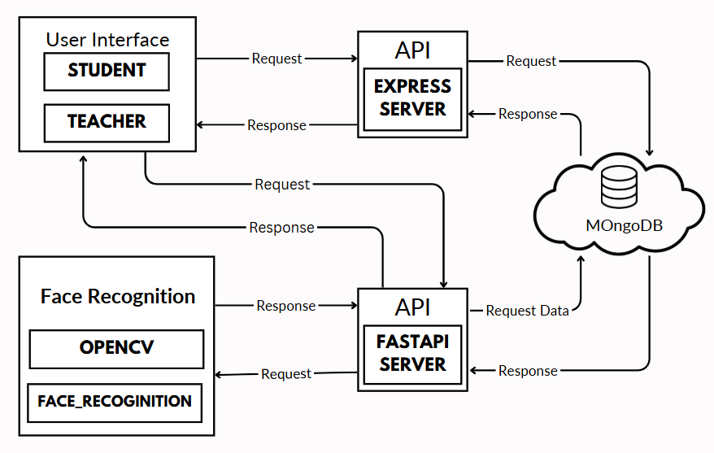

# 🎓 Quick Attendance – Real-Time Face Recognition Based System

> A full-stack intelligent attendance system capable of identifying **10+ students simultaneously** with high precision using live webcam feed and facial recognition.

---

## 🧠 Project Overview

**Quick Attendance** is a smart classroom attendance system built to automate and streamline the attendance process using **live multi-face detection**. It replaces traditional manual methods with a real-time camera-based approach, allowing teachers to mark attendance instantly while students can track and manage their records.

---

## ✨ Core Highlights

- 🎯 Real-time face recognition of **10+ students simultaneously**  
- 📸 Automatic attendance marking via webcam or media upload  
- 🧑‍🏫 Role-based system: Teacher (manage classes) & Student (track records)  
- 🔁 Attendance correction request & approval workflow  
- 📊 Printable attendance reports  
- 🔐 Built with a modern full-stack: FastAPI + Express + MongoDB + React

---

## 🖼️ System Architecture

> *This diagram illustrates the flow of attendance data across FastAPI (Python), Express.js (Node.js), MongoDB, and the React-based frontend.*

---

## 🚀 Features Breakdown

### 👩‍🏫 Teachers
- Create/manage/delete classes
- Take attendance (live / upload)
- Approve or reject student requests
- Generate printable reports

### 🧑‍🎓 Students
- View personal attendance logs
- Request attendance corrections
- Track attendance percentage across subjects

---

## ⚙️ Technical Overview

| Layer        | Technology                          |
|--------------|--------------------------------------|
| Frontend     | React.js                             |
| Backend      | FastAPI (Python), Express (Node.js)  |
| Database     | MongoDB                              |
| Recognition  | OpenCV + `face_recognition` (dlib)   |
| Communication| WebSockets                           |

---

## 📊 Real-World Performance

- Achieved consistent real-time recognition of **10+ students simultaneously**
- Delivered near-perfect accuracy under well-lit conditions
- Quick frame capture and identity match using optimized face encodings
- Integrated error handling and fallback for correction requests

---

## 🔮 Future Scope

- 🔔 Notification system for attendance status or updates  
- 📤 Allow students to submit updated face photos   
- 🛡️ Admin portal for user roles, system settings, and audit logs  
- 🧾 More export formats (CSV, Excel, etc.)

---

## 📄 License & Credits

> Developed by **Shiv Dwivedi**   
> Department of Computer Science & Information Technology, SHUATS  
> © 2025 – All Rights Reserved

---

